## Lifecycle Diagram

---

## Architecture overview

We use a **deferred-write job queue** to bridge the autofill extension and the main app. The autofill extension connects to the vault client in **read-only mode** (`readOnly: true`) — it can read vault data but cannot write. All vault writes go through the job queue:

**Shared storage** is the iOS App Group container (`group.com.noxtton.pearpass`) or Android's app files directory. Both the extension and the main app can read/write to `pearpass_jobs/`.

---

## Encryption sharing

The shared entropy is the vault's **`hashedPassword`** — a 32-byte key derived from the user's master password via Argon2id. It is not a password hash in the traditional sense (used for verification); it is a **key derivation** output sized for use as a `crypto_secretbox` key (XSalsa20-Poly1305). When the user first creates their master password, the worklet derives the key. After derivation, the hashedPassword is stored in the master vault's metadata.
The hashedPassword is only readable when the vault is unlocked. The extension enforces this by requiring authentication before any vault operations.

```mermaid
flowchart TD
    A["Master Password"] --> B["Argon2id"]
    B --> C["hashedPassword — hex encoded"]
    C --> D["Stored in master vault under key 'masterEncryption'"]
    D --> E["Extension reads via vaultsGet()"]
    D --> F["Main App reads via getHashedPassword()"]
    E --> G["Encrypt jobs.enc <br/> (XSalsa20-Poly1305)"]
    F --> H["Decrypt jobs.enc <br/> (XSalsa20-Poly1305)"]

    class A key
    class B,C process
    class D storage
    class E,F consumer
    class G,H crypto
```

Both sides use the identical 32-byte key with the same algorithm. There is no key exchange protocol; the key already exists in the vault, and both processes access it through the same worklet.
The key never leaves the device. It is pre-derived, and both sides use the identical algorithm (XSalsa20-Poly1305) with the same key.